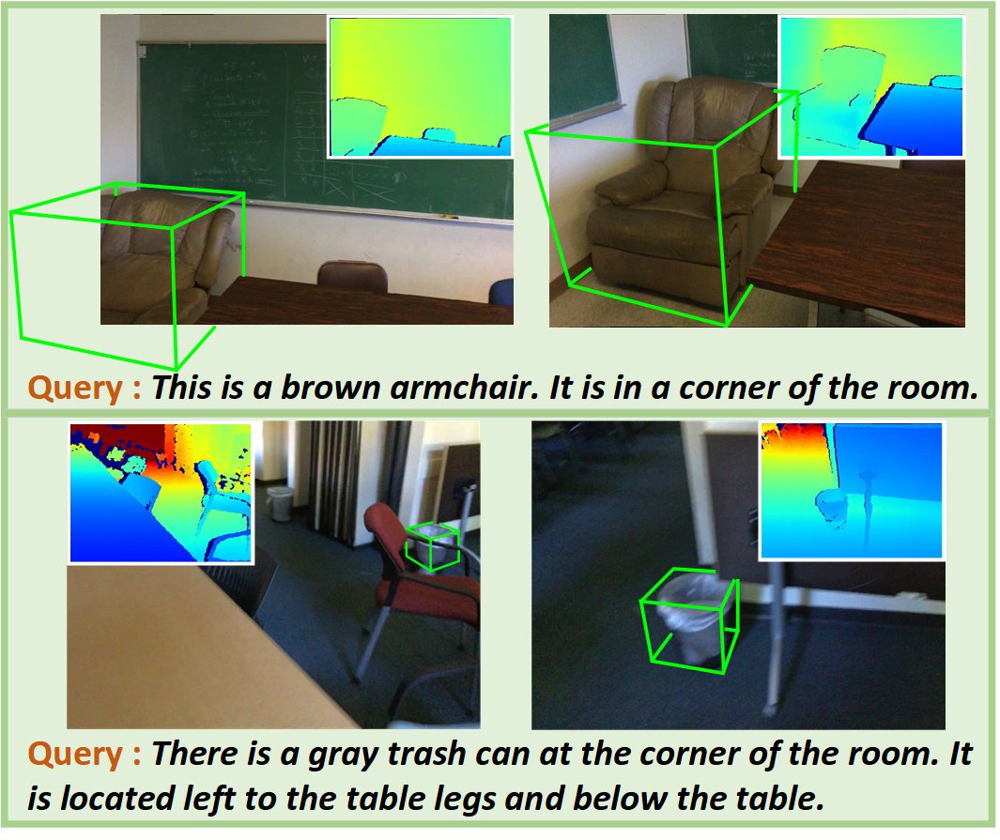
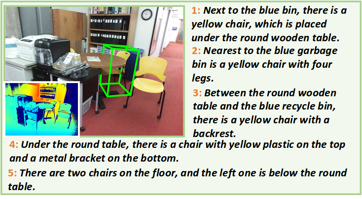

# Refer-it-in-RGBD

This is the repository of our paper 'Refer-it-in-RGBD: A Bottom-up Approach for 3D Visual Grounding in RGBD Images' in CVPR 2021 
 
Paper - <a href="https://arxiv.org/pdf/2103.07894" target="__blank">ArXiv - pdf</a> (<a href="https://arxiv.org/abs/2103.07894" target="__blank">abs</a>) 
 
Project page: https://unclemedm.github.io/Refer-it-in-RGBD/  
### Introduction
We present a novel task of 3D visual grounding in <b>single-view RGB-D images</b> where the referred objects are often only <b>partially scanned</b>. 
In contrast to previous works that directly generate object proposals for grounding in the 3D scenes, we propose a bottom-up approach to gradually aggregate information, effectively addressing the challenge posed by the partial scans. 
Our approach first fuses the language and the visual features at the bottom level to generate a heatmap that coarsely localizes the relevant regions in the RGB-D image. Then our approach adopts an adaptive search based on the heatmap and performs the object-level matching with another visio-linguistic fusion to finally ground the referred object. 
We evaluate the proposed method by comparing to the state-of-the-art methods on both the RGB-D images extracted from the ScanRefer dataset and our newly collected SUN-Refer dataset. Experiments show that our method outperforms the previous methods by a large margin (by 11.1% and 11.2%  Acc@0.5) on both datasets.

### Dataset
<a href="https://unclemedm.github.io/Refer-it-in-RGBD/SUNREFER_dataset.json">Download SUNREFER dataset</a> 
SUNREFER dataset contains 38,495 referring expression corresponding to 7,699 objects from SUNRGBD dataset. Here is one example from SUNREFER dataset:

